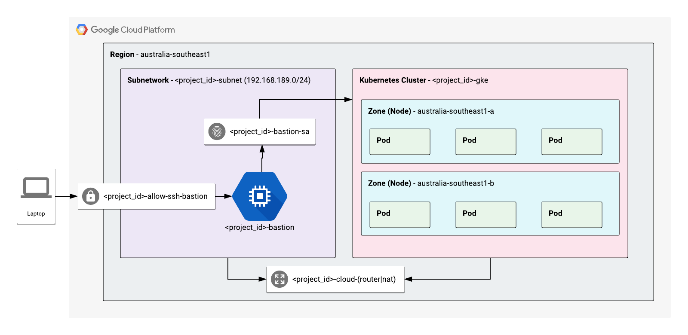

# GKE Istio - Boostrap

Google Cloud Platform Istio bootstrap for GKE

---

## Guides

---

* [Practical Istio - Introduction](https://devopstar.com/2019/06/16/practical-istio-introduction-and-setup/)
  * A brief introduction into Istio and its role in modern production Kubernetes. We prepare for the future instalments of Practical Istio.
* [Practical Istio - Private Kubernetes Deployment](https://devopstar.com/2019/06/16/practical-istio-private-kubernetes-deploy/)
  * Deployment of Kubernetes onto GKE making use of GCP Deployment Manager. The process insures we end up with a robust private cluster to work with moving forward.
* [Practical Istio - Init & Install](https://devopstar.com/2019/06/16/practical-istio-init-and-install/)
  * Initialising the Istio Custom Definitions and installing Istio onto our fresh Kubernetes cluster.

---

## Architecture

---



---

## Endpoints

### istio-system Namespace

| Service    | Endpoint                                                                                     |
|------------|----------------------------------------------------------------------------------------------|
| kiali      | [http://gke.devopstar.com:15029/kiali/console](http://gke.devopstar.com:15029/kiali/console) |
| prometheus | [http://gke.devopstar.com:15030](http://gke.devopstar.com:15030)                             |
| grafana    | [http://gke.devopstar.com:15031](http://gke.devopstar.com:15031)                             |
| tracing    | [http://gke.devopstar.com:15032](http://gke.devopstar.com:15032)                             |

### default Namespace

| Service    | Endpoint                                                                         |
|------------|----------------------------------------------------------------------------------|
| prometheus | [http://gke.devopstar.com/prometheus](http://gke.devopstar.com/prometheus)       |
| grafana    | [http://gke.devopstar.com/grafana/login](http://gke.devopstar.com/grafana/login) |

## Setup

---

### Deploy Script Usage

```bash
./deploy.sh <project_id> <resource> <action>
```

Resources must be deployed and removed in the following order

| create       | delete       |
|--------------|--------------|
| iam          | dns          |
| network      | bastion      |
| cloud-router | gke          |
| gke          | cloud-router |
| bastion      | network      |
| dns          | iam          |

Or simply run the following to bring it all up

```bash
./deploy.sh <project_id> all create
```

---

## Manage

---

### Connect

Connect to the bastion host and manage the kubernetes cluster from there using the steps below

#### SCP Bastion

```bash
gcloud compute scp \
  --recurse ./k8s* <project_id>-bastion:~/ \
  --zone australia-southeast1-a
```

#### SSH Bastion

```bash
gcloud compute ssh <project_id>-bastion \
  --project <project_id> \
  --zone australia-southeast1-a
```

#### Kubernetes Connect

```bash
gcloud container clusters get-credentials <project_id>-gke \
  --project <project_id> \
  --region australia-southeast1
```

---

## Istio

---

### Istio Install

**Note**: If you have a domain name you will be using, make sure to replace *DNS_NAME* with that entry. If you aren't going to use one, you'll need to patch out references to `gke.devopstar.com` replacing it with the ingres IP you are assigned later.

```bash
# Initialize Istio
./k8s/istio/istio.sh <project_id> init

# Install Istio Services
./k8s/istio/istio.sh <project_id> install
```

### Configure Istio

#### Gateways

```bash
kubectl apply -f k8s/istio/gateways
```

#### Destination Rules

```bash
kubectl apply -f k8s/istio/destination-rules
```

#### Virtual Services

```bash
kubectl apply -f k8s/istio/virtual-services
```

#### Whitelist

```bash
kubectl apply -f k8s/istio/whitelists
```

---

## Helm

---

### Role-based Access Control (RBAC)

We'll deploy an RBAC configuration that is used by helm. Perform the following actions from the Bastion server

```bash
# Create tiller service account & cluster role binding
kubectl create -f k8s/rbac-config.yaml

# init helm with the service account
helm init --service-account tiller --history-max 200
```

### Install External DNS

```bash
helm install \
  --name external-dns stable/external-dns \
  -f k8s/external-dns.yaml --wait
```

### Install Prometheus & Grafana

```bash
helm install \
  --name prometheus stable/prometheus \
  -f k8s/prometheus/values.yaml --wait

kubectl apply \
  -f k8s/grafana/configmap.yaml
helm install \
  --name grafana stable/grafana \
  -f k8s/grafana/values.yaml --wait
```

### Delete Packages

```bash
helm delete --purge external-dns grafana prometheus
./k8s/istio/istio.sh <project_id> remove
```

---

## Attribution

---

- RBAC Configuration Example - [https://github.com/helm/helm/blob/master/docs/rbac.md](https://github.com/helm/helm/blob/master/docs/rbac.md)
- Deployment Manager samples - [https://github.com/GoogleCloudPlatform/deploymentmanager-samples](https://github.com/GoogleCloudPlatform/deploymentmanager-samples)
  - [cloud_router](https://github.com/GoogleCloudPlatform/deploymentmanager-samples/tree/master/community/cloud-foundation/templates/cloud_router)
  - [firewall](https://github.com/GoogleCloudPlatform/deploymentmanager-samples/tree/master/community/cloud-foundation/templates/firewall)
  - [gke](https://github.com/GoogleCloudPlatform/deploymentmanager-samples/tree/master/community/cloud-foundation/templates/gke) - with modifications from [Praveen Chamarthi](https://github.com/GoogleCloudPlatform/deploymentmanager-samples/pull/326)
  - [iam_member](https://github.com/GoogleCloudPlatform/deploymentmanager-samples/tree/master/community/cloud-foundation/templates/iam_member)
  - [network](https://github.com/GoogleCloudPlatform/deploymentmanager-samples/tree/master/community/cloud-foundation/templates/network)
